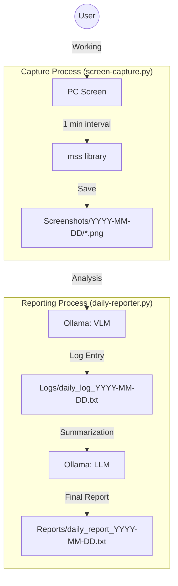

# Daily Reporter 📸🤖

毎分の画面キャプチャをVLM（Vision Language Model）で分析し、一日の終わり（または指定時）にLLM（Large Language Model）が日報として要約を出力するプロジェクトです。

## プロジェクト概要

このプロジェクトは、仕事や学習の記録を自動化することを目的としています。
2つの主要なスクリプトで構成されています：

1.  **`screen-capture.py`**: バックグラウンドで動作し、1分ごとに画面キャプチャを保存します。
2.  **`daily-reporter.py`**: 保存されたキャプチャをVLMで1枚ずつ分析し、そのログを元にLLMが日報を生成します。

## 特徴

-   **自動キャプチャ**: `mss` ライブラリを使用した高速なスクリーンショット。
-   **VLMによる行動分析**: `qwen3-vl:8b` などのVisionモデルを使用して、画像から「何をしていたか」を言語化。
-   **LLMによる自動要約**: `gemma3:27b` などの強力なモデルを使用して、断片的なログから整合性の取れた日報を作成。
-   **柔軟なプロンプト設定**: `Prompts/` ディレクトリ内のMarkdownファイルを編集することで、AIの役割や分析の視点をカスタマイズ可能。

## システム構成図



## セットアップ

### 1. 前提条件

-   Python 3.10以上
-   [Ollama](https://ollama.com/) がインストールされ、動作していること

### 2. ライブラリのインストール

```bash
pip install mss Pillow schedule ollama
```

### 3. モデルの準備

本プロジェクトではデフォルトで以下のモデルを使用します。あらかじめ `ollama pull` しておいてください。

```bash
ollama pull qwen3-vl:8b
ollama pull gemma3:27b
```
※ モデル名は `daily-reporter.py` の定数（`VLM_MODEL`, `LLM_MODEL`）を書き換えることで変更可能です。

## 使い方

### 1. 画面キャプチャの開始

作業を開始する際に実行します。

```bash
python screen-capture.py
```
実行中、1分ごとに `Screenshots/YYYY-MM-DD/` ディレクトリに画像が保存されます。

### 2. 日報の生成

一日の終わりなどに実行します。

```bash
# 本日の日報を生成
python daily-reporter.py report

# 特定の日付（YYYY-MM-DD）の日報を生成
python daily-reporter.py report 2023-12-30
```
生成された日報は `Reports/` ディレクトリに保存されます。

### 3. データの整理

不要になったスクリーンショットを削除します。

```bash
python daily-reporter.py clear 2023-12-30
```

## カスタマイズ

`Prompts/` ディレクトリ内のファイルを編集することで、分析の精度や日報のトーンを調整できます。

-   `role.md`: AIのキャラクター設定
-   `user_profile.md`: あなた自身の職種や背景情報
-   `user_tools.md`: 普段使用しているツールやアプリなどの情報
-   `task.md`: 具体的に何を分析してほしいかの指示

## ライセンス

[MIT License](LICENSE)
